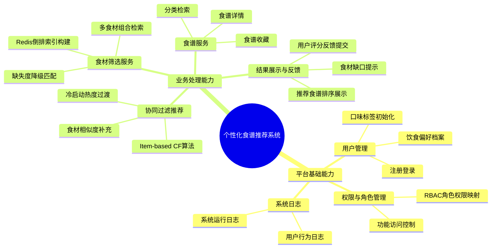

# 个性化食谱推荐系统

## 1. 系统功能结构图


## 2. 技术架构图
```mermaid
graph TD
    %% 样式定义
    classDef front fill:#e1f5fe,stroke:#01579b,stroke-width:2px;
    classDef business fill:#fff9c4,stroke:#fbc02d,stroke-width:2px;
    classDef algo fill:#f3e5f5,stroke:#7b1fa2,stroke-width:2px;
    classDef db fill:#e0f2f1,stroke:#00695c,stroke-width:2px;
    classDef redis fill:#ffebee,stroke:#c62828,stroke-width:2px;

    %% 第一层：前端层
    subgraph Frontend [第一层：前端层 (Vue.js + Element-Plus)]
        direction TB
        F1[食材录入页]:::front
        F2[推荐结果页]:::front
        F3[个人偏好设置页]:::front
    end

    %% 第二层：后端服务层
    subgraph Backend [第二层：后端服务层]
        direction TB
        subgraph JavaService [后端业务服务 (Java Spring Boot)]
            B1[用户/权限管理]:::business
            B2[食谱基础服务]:::business
            B3[业务逻辑编排]:::business
        end
        
        subgraph PyService [算法服务 (Python Flask)]
            A1[食材筛选逻辑]:::algo
            A2[协同过滤CF算法]:::algo
            A3[相似度计算引擎]:::algo
        end
    end

    %% 第三层：数据支撑层
    subgraph DataLayer [第三层：数据支撑层]
        direction TB
        subgraph DB [数据层 (MySQL)]
            D1[(用户基础信息)]:::db
            D2[(标准化食谱数据)]:::db
            D3[(用户行为日志)]:::db
        end
        
        subgraph Cache [缓存层 (Redis)]
            R1[(倒排索引数据)]:::redis
            R2[(计算中间结果)]:::redis
            R3[(热门食谱缓存)]:::redis
        end
    end

    %% 交互关系连线
    F1 & F2 & F3 -- HTTP请求 --> B3
    
    B3 -- 调用基础数据 --> B1 & B2
    B3 -- RPC/HTTP算法调用 --> A1 & A2
    
    B1 & B2 -- CRUD操作 --> D1 & D2 & D3
    A1 -- 高速查询 --> R1 & R2
    A2 -- 读取行为数据 --> D3
    A3 -- 写入/读取 --> R3
    
    %% 补充连线
    A2 -. 读取基础数据 .-> D2
```
